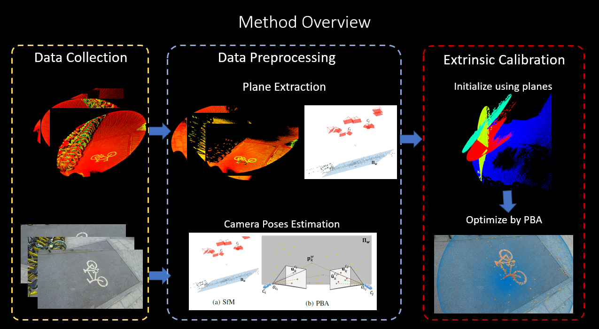
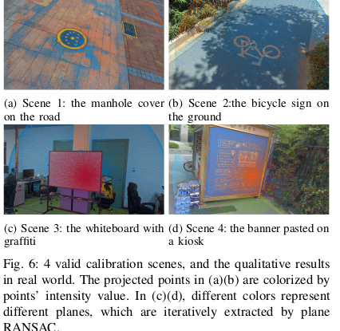
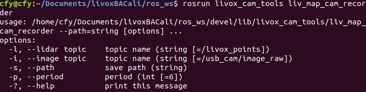

# PBACalib

  ### Description

<!-- - This is the original work on livox-camera extrinsic calibration. The corresponding paper is " PBACalib: Target-less Extrinsic Calibration for High-Resolution LiDAR-Camera System Based on Plane-Constrained Bundle Adjustment". -->
- This work is implemented by Matlab.



### Data Preparation
- Calibration Scene
  - First find a calibration scene, which is a plane with arbitrary texture. The calibration accuracy performs better when 1) texture is rich 2) the plane is strictly flat 3) the background is clean.
  - The example scenes are shown as follows  
     
  
- Collection tools
  - We supply tools to collect images and point could. For our sensors operate in ROS
  framework, we write c++ tools to subscribe ROS topic and save data.
  - The tool is in folder **ros_ws**, which is a ros workspace. Run following command to build and execuate the tool
    ```shell
      catkin_make
      rosrun livox_cam_tools liv_map_cam_recorder
    ```
    It will print help notes to tell you what parameters you need to specify, as follows
    
- Undistorted images
  Run matlab file **undist_imgs.m** to undistort all images. Please change the intrinsic, distortion matrix and data file path.
- Default data structure 
  ```
  data/img/1.png raw images
  data/img/2.png raw images 
  ...
  ----------------------------
  data/img_un/1.png undistorted images
  data/img_un/2.png undistorted images 
  ...
  ----------------------------
  data/pcd/1.pcd raw pcds
  data/pcd/2.pcd raw pcds
  
  ```
### Estimate camera poses using structure from motion
 We use [colmap](https://github.com/colmap/colmap/releases) to conduct SfM and export model files as txt into folder "models". Then the default data structure is shown as follows
 ```
  data/img/1.png raw images
  data/img/2.png raw images 
  ...
--------------------------
  data/img_un/1.png undistorted images
  data/img_un/2.png undistorted images 
  ...
--------------------------
  data/pcd/1.pcd raw pcds
  data/pcd/2.pcd raw pcds
  ...
--------------------------
  models/cameras.txt
  models/images.txt
  models/points3D.txt
  models/project.ini
 ```
 Please read readme files in colmap to learn how to conduct SfM

### Calibration 
  Run "main_cali_real.m" file in matlab folder to calibrate the extrinsics between camera and dense LiDAR. Please modify the parameters in  "main_cali_real.m", which  contains

  ```
  K = [897.4566,0,635.4040;
    0,896.7992,375.3149;
      0,0,1];
  D = [-0.4398 0.2329 -0.0011 2.0984e-04 -0.0730];

  TInit = [0.0324   -0.9994    0.0130   -0.0152
      0.0215   -0.0123   -0.9997    0.0695
      0.9992    0.0327    0.0211   -0.0132
      0         0         0    1.0000];
  data_path = "/home/cfy/Documents/livoxBACali/data/real/scene2/";
  pcd_folder = data_path+"pcd";
  img_folder = data_path+"img_un";
  ```
  The extrinsics and projection result will show automatically when finished.

### Data

- simulation environment: based on gazebo, we published on this [repo](https://github.com/chenfeiyi/LivoxCamSimu)

### TODO
- Wait for updating the collection tools and the collected data.
- Please feel free to report issue

